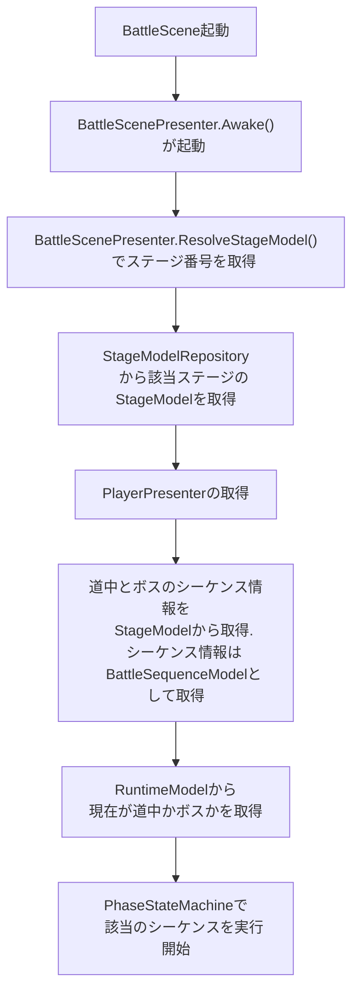
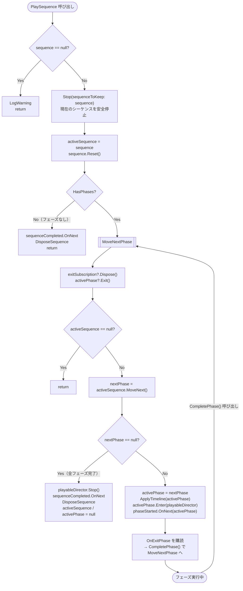
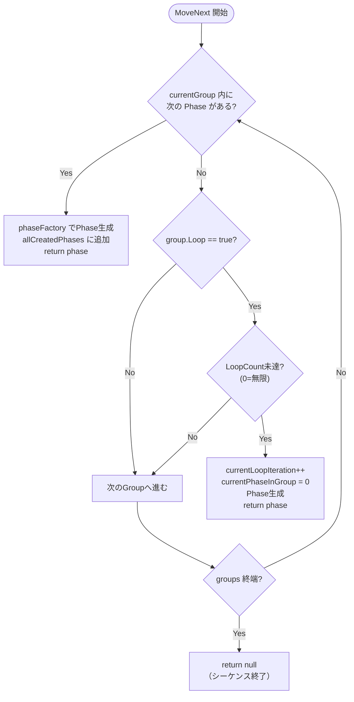
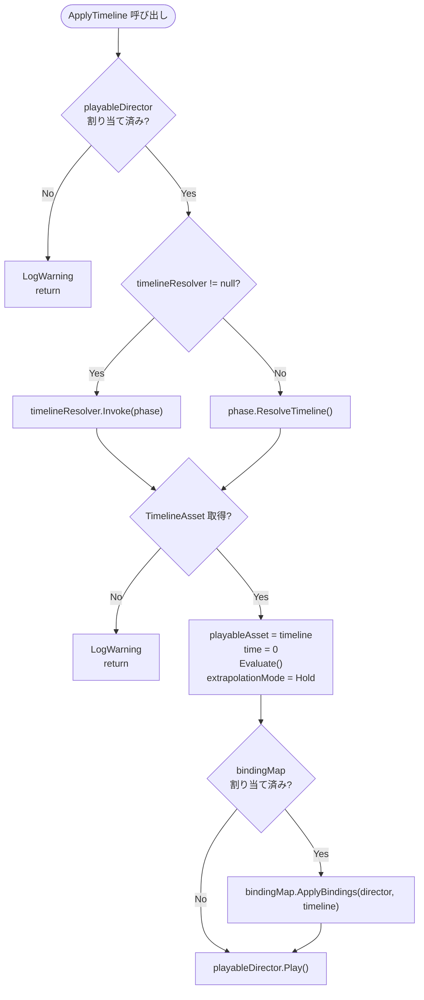
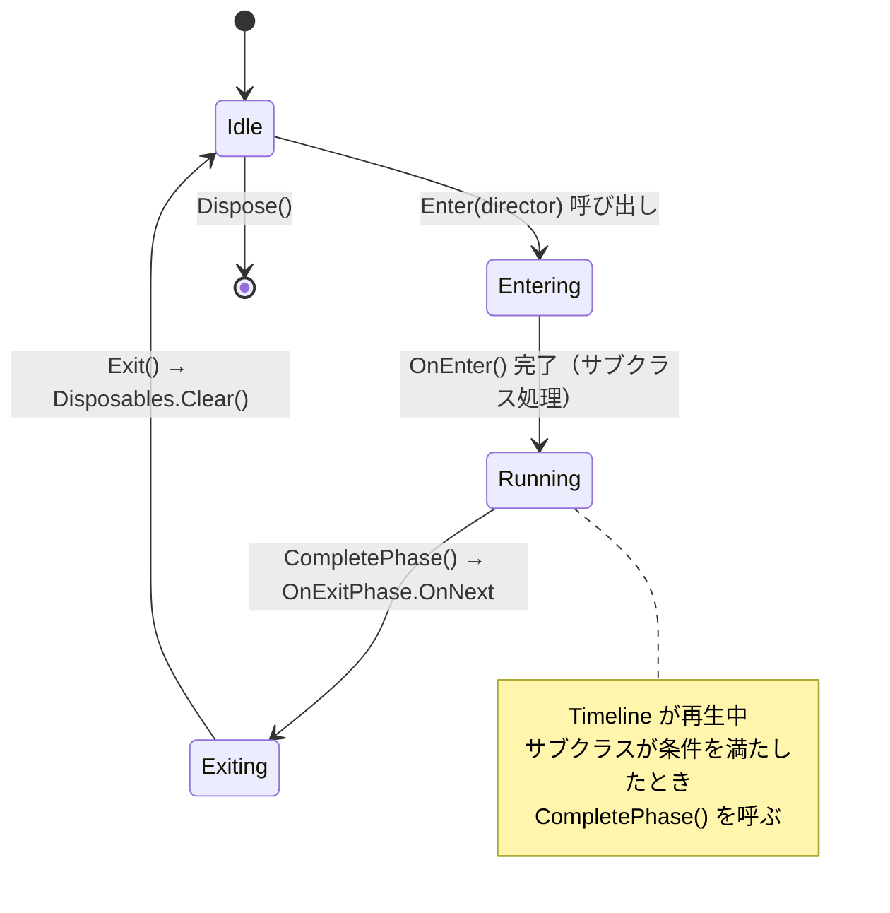
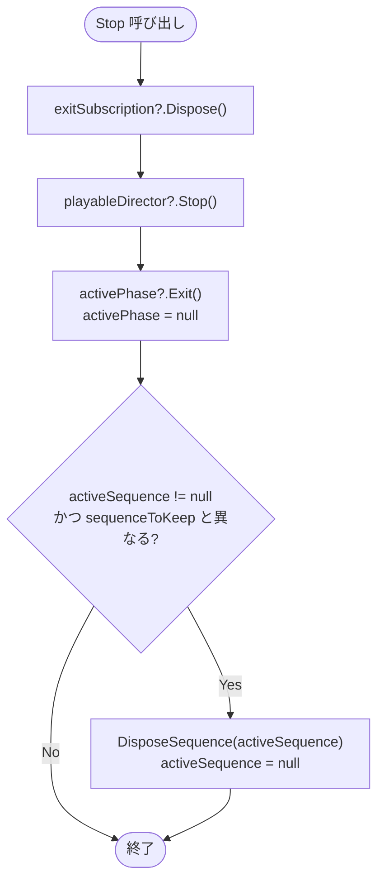
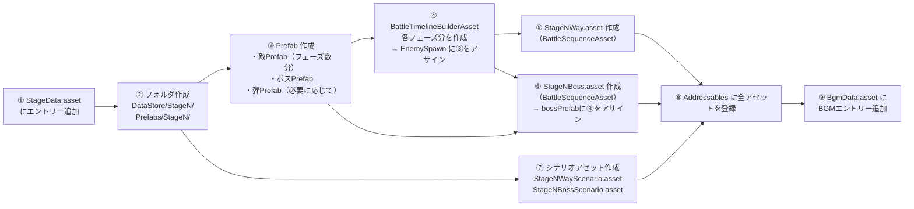

# バトルステージ実装マニュアル

## バトルシーンのざっくり流れ

### 起動時



### バトルの各シーケンス

#### PlaySequence → MoveNextPhase ループ



#### BattleSequenceModel.MoveNext() — グループ・ループ処理



#### ApplyTimeline — Timeline のセットアップ



#### フェーズのライフサイクル



#### Stop 処理



## 実装手順

### 新規ステージの追加

基盤実装は完成済みのため、以下のデータ作業のみで新しいステージを追加できます。
（ここでは `StageN` を例として記述）

#### ステップ全体の依存関係



---

#### ① 基本骨子を作成

```
Assets/Project/DataStore/StageN/
  Attack/     # EnemyのInspectorで設定する攻撃のプリセットが入っている
  Boss/
  Ease/       # DOTweenのカスタムEaseが入っている
  Way/        
  Movement/   # EnemyのInspectorで設定する動きのプリセットが入っている

Assets/Project/Scenes/Battle/Prefabs/StageN/
```

`waySequenceAddress`: `Assets/Project/DataStore/Stage3/Way/Stage3Way.asset`
`bossSequenceAddress`: `Assets/Project/DataStore/Stage3/Boss/Stage3Way.asset`


Stage1 の構成を参考にコピーして中身を差し替えるのが最速。
> Scaffold を作りたい..

---

#### ② StageData.asset にエントリーを追加

パス: `Assets/Project/DataStore/StageData.asset`
Inspector で `stageData` リストに以下フィールドを持つエントリーを追加する。

| フィールド | 例                                                         | 説明 |
|---|-----------------------------------------------------------|---|
| `id` | `"3"`                                                     | ステージID（文字列） |
| `stageNumber` | `3`                                                       | ステージ番号。`BattleStageType` enum に対応 (1〜6, EX=7) |
| `charaStillAddress` | `"Tatsumi"`                                               | キャラクタースチルのアドレス |
| `title` | `"ほげほげほげほげ"`                                              | ステージタイトル |
| `waySequenceAddress` | `"Assets/Project/DataStore/Stage3/Way/Stage3Way.asset"`   | 道中シーケンスアセットのフルパス |
| `bossSequenceAddress` | `"Assets/Project/DataStore/Stage3/Boss/Stage3Boss.asset"` | ボスシーケンスアセットのフルパス |

> `stageNumber + 2` が `SceneType` enum のインデックスに対応するため、enum の順序を変えないこと。

---

#### ③ Prefab を作成

`Assets/Project/Scenes/Battle/Prefabs/StageN/` で右クリックから各エンティティのプレふぁぶを作成する。 

| Base Prefab | 作成メニュー | 主要コンポーネント | 用途 |
|---|---|---|---|
| `EnemyEntityBase` | `Battle > Enemy Entity Base` | `EnemyEntityPresenter`, `EnemyEntityView`, `SpriteRenderer`, `BulletPool` | 道中・中ボス用の敵キャラ |
| `Bullet` | `Battle > Bullet` | `BulletEntityPresenter` | ステージ固有の敵弾 |
| `Boss` | `Battle > Boss` | `BossEntityPresenter`, `EnemyEntityView`, `BulletPool[]` | ボスキャラ |

**敵 Prefab（道中フェーズ数分）**

`Enemy Entity Base` でコピーを作成し、Inspector で以下を設定する。

| フィールド | 説明 |
|---|---|
| `maxHp` | 最大HP |
| `contactDamage` | 体当たりダメージ |
| `movementPreset` / `movementSteps` | 移動パターン（Preset 優先、なければインライン `IMovementStep`） |
| `attackPreset` / `attackTimeline` | 攻撃パターン（Preset 優先） |
| `bulletPool` | 使用する弾 Prefab の Pool |

> 作成した敵 Prefab は ④ の `BattleTimelineBuilderAsset > Enemy Spawn Tracks > EnemySpawnDefinition.prefab` にアサインする。

**ボス Prefab（1体）**

`Boss` でコピーを作成し、Inspector で以下を設定する。

| フィールド | 説明 |
|---|---|
| `maxHp` | 最大HP |
| `contactDamage` | 体当たりダメージ |
| `bulletPools` | 弾の種類数分の BulletPool 配列 |

> 攻撃・移動パターンはボス Prefab に持たせず、各フェーズの `BattleTimelineBuilderAsset` > `Boss Attack Preset` / `Boss Movement Preset` で制御する。

> 作成したボス Prefab は ⑥ の `BattleSequenceAsset (Boss).bossPrefab` にアサインする。

**演出オブジェクト（必要に応じて）**

`Wall` や `Spectrum` などシーン上に常駐させる演出 GameObject は Prefab として `Prefabs/StageN/` に格納しバトルシーンに配置する。
Timeline の Control Track / Activation Track から参照するため、`BattleTimelineBindingMap`（シーン上の MonoBehaviour）に **トラック名 → GameObject** の対応を登録する。

| 設定場所 | 内容 |
|---|---|
| `BattleTimelineBuilderAsset` の `Control Tracks` / `Activation Tracks` の `trackName` | Timeline 側のトラック名 |
| `BattleTimelineBindingMap` の各 `BindingEntry` | トラック名 → シーン上の GameObject |

> トラック名は**完全一致**で検索されるため、両者を必ず一致させること。

------

#### ④ BattleSequenceAsset（道中）を作成

メニュー: `Assets > Create > Battle > Phase Sequence`  
ファイル名に `Way` を含めると `situation` が自動で `Way` にセットされる。

`sequenceGroups` に `SequenceGroup` を追加し、各グループに `BattlePhaseDefinition` を入れる。

**BattlePhaseDefinition の設定項目**

| フィールド | 説明 |
|---|---|
| `phaseId` | フェーズを識別する文字列 |
| `timelineBuilder` | 上記④で作成した `BattleTimelineBuilderAsset` |
| `timelineBuilderStrong` | HP が閾値以下のときに使う強攻撃用ビルダー（任意） |
| `strongAttackHpThresholdPercent` | 強攻撃切り替えHP（%）。デフォルト 50 |
| `exitConditionConfig` | フェーズ終了条件（下表） |

**ExitCondition の選択肢**

| 種別 | 説明 |
|---|---|
| `TimeLimitExitConditionConfig` | 指定秒数経過で次フェーズへ |
| `AllEnemiesDefeatedExitConditionConfig` | スポーンした全敵を倒すと次フェーズへ |
| `BossHpThresholdExitConditionConfig` | ボスHPが閾値を下回ると次フェーズへ |
| `BgmPositionExitConditionConfig` | BGM の再生位置が指定サンプルに達すると次フェーズへ |
| `CompositeExitConditionConfig` | 上記を AND / OR で組み合わせ |

**SequenceGroup のループ設定**

| フィールド | 説明 |
|---|---|
| `loop` | true にするとグループ内フェーズをループ |
| `loopCount` | ループ回数。`0` で無限ループ |

---

#### ⑤ BattleTimelineBuilderAsset （道中）を作成（フェーズ数分）

メニュー: `Assets > Create > Battle > Timeline Builder`


各フェーズの攻撃パターン・演出を設定するアセット。

| セクション | 内容 |
|---|---|
| Signal Tracks | タイムライン上に発火する汎用シグナル |
| Animation Tracks | キャラや背景のアニメーション |
| Activation Tracks | GameObject の表示/非表示 |
| Audio Tracks | SE・BGM の再生 |
| Control Tracks | 子Timelineの制御（演出オブジェクトを `trackName` でバインド） |
| Enemy Spawn Tracks | 敵をスポーンするシグナル。`EnemySpawnDefinition.prefab` に③の敵Prefabをアサイン |
| Boss Attack Preset | ボスの攻撃設定（ボスフェーズのみ） |
| Boss Movement Preset | ボスの移動設定（ボスフェーズのみ） |


#### ⑥ BattleSequenceAsset（ボス）を作成

道中と同じ手順。ファイル名に `Boss` を含めると `situation` が自動で `Boss` になる。

ボスシーケンスには追加設定が必要:

| フィールド | 説明 |
|---|---|
| `bossPrefab` | ボスの GameObject Prefab |
| `bossSpawnPosition` | ボスのスポーン座標 |
| `bossEntranceMovement` | ボス登場時のモーション（`IMovementStep` のリスト） |

---

### ⑦ ⑤のボス版を作成

---

#### ⑧ シナリオアセットを作成

※ 基本的に `Tools/Import Scenario` を使用して `.txt` を取り込めば良い。

`ScenarioModelRepository` がファイル名を以下のルールで自動解決するため、**命名規則を厳守**すること。

| ファイル | パス |
|---|---|
| 道中後シナリオ | `Assets/Project/DataStore/StageN/Way/StageNWayScenario.asset` |
| ボス後シナリオ | `Assets/Project/DataStore/StageN/Boss/StageNBossScenario.asset` |

アセットの型は `ScenarioData`。`steps` に台詞・演出コマンドを順番に追加する。

---

#### ⑨ Addressables に全アセットを登録

以下のアセットをすべて Addressables に追加し、**アドレスをアセットのフルパスと一致させる**。
（`BattleSequenceModelRepository` と `ScenarioModelRepository` がフルパスをアドレスとして直接使用するため）

- `StageNWay.asset`
- `StageNBoss.asset`
- `StageNWayScenario.asset`
- `StageNBossScenario.asset`
- 各 `BattleTimelineBuilderAsset`（④で作成したもの）

---

#### ⑩ BgmData.asset に BGM エントリーを追加

※ これは全てあるはずなので、ゲームを起動して動いていればスキップしてok
パス: `Assets/Project/DataStore/BgmData.asset`

`bgmData` リストに道中・ボスの2エントリーを追加する。

| フィールド | 道中 | ボス |
|---|---|---|
| `sceneType` | `StageN`（※） | `StageN` |
| `bgmType` | `BattleWay` | `BattleBoss` |
| `loopStartSamples` | イントロ終了サンプル | 同左 |
| `loopEndSamples` | 0 でクリップ全体 | 同左 |

> ※ `SceneType.StageN` は `stageNumber + 2` のインデックスに対応。
> Stage1=3, Stage2=4, Stage3=5, Stage4=6, Stage5=7, Stage6=8, StageEx=9

BGM の AudioClip 自体も `SoundAssetRepository` のAddressables経由でロードされるため、対応するクリップアセットもAddressablesへの追加が必要。

---

#### その他確認事項

- `BattleStageType` enum は Stage1〜Stage6 と StageEx (7) まで定義済み。enum 変更不要。
- `SceneType` enum も Stage1〜StageEx まで対応済み。変更不要。
- キャラクタースチル画像（`charaStillAddress`）は `StillAssetRepository` 経由でロードされる。新キャラの場合は Textures フォルダへの追加と Addressables 登録も必要。
