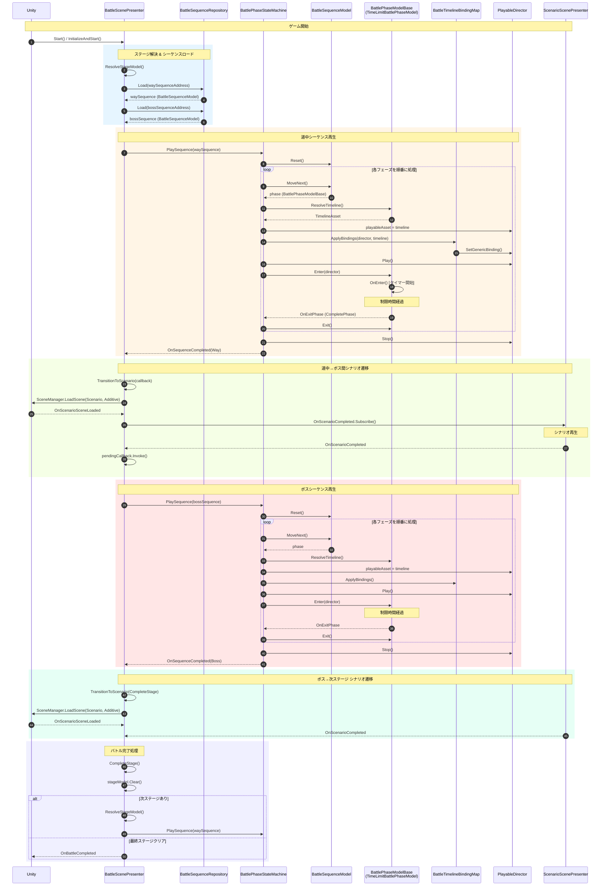
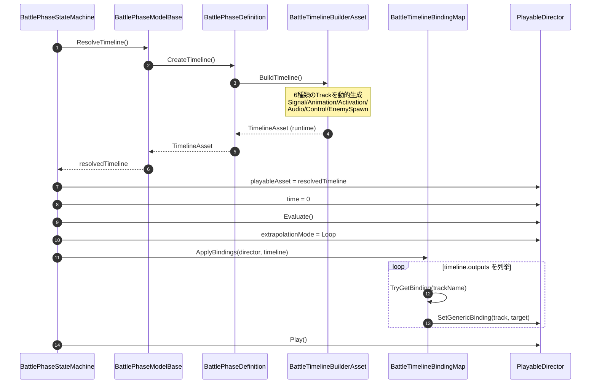
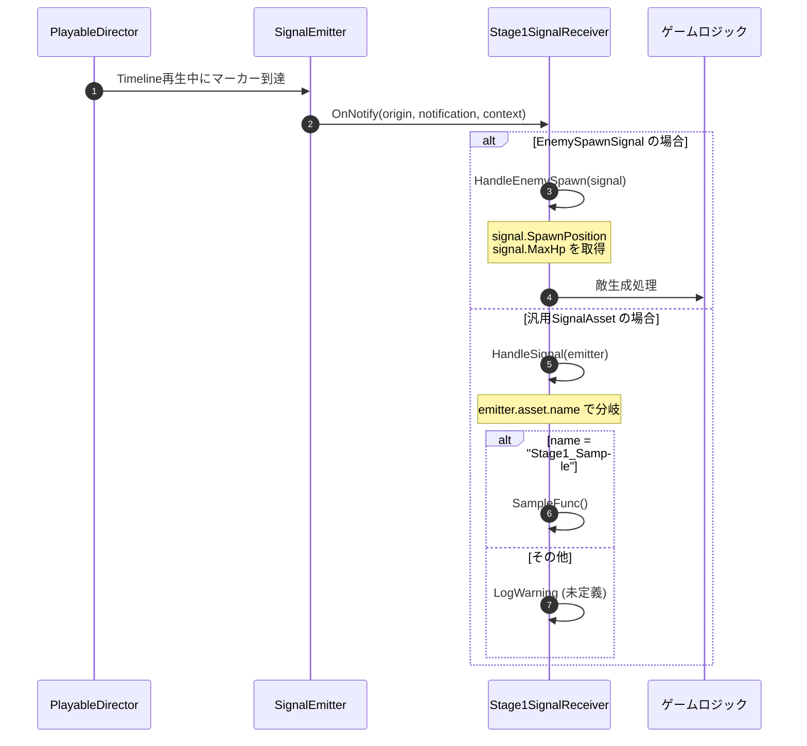
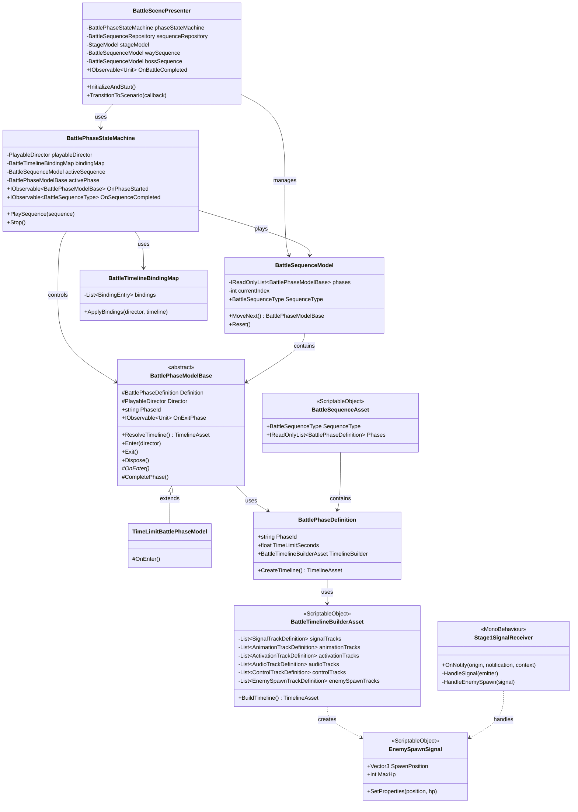
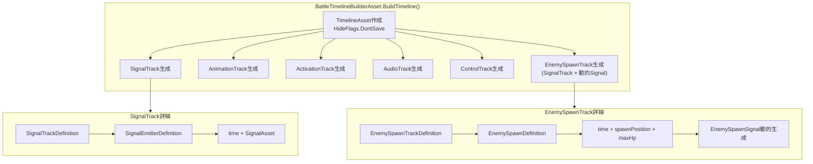

# Battleシーン インゲーム シーケンス図

## 概要
(正直にいうと、僕は見ていません)
`Assets/Project/Scenes/Battle/Scripts` 配下のコードを分析し、バトルシーン全体の処理フローをシーケンス図としてまとめました。

---

## 全体フロー シーケンス図

---

## フェーズ内 Timeline再生 詳細

---

## Signal処理フロー

---

## クラス構成図

---

## 状態遷移図

```mermaid
stateDiagram-v2
    [*] --> Idle: シーン開始
    
    state "道中フェーズ" as WayPhases {
        [*] --> WayPhase1: PlaySequence(waySequence)
        WayPhase1 --> WayPhase2: OnExitPhase (時間切れ)
        WayPhase2 --> WayPhaseN: OnExitPhase
        WayPhaseN --> [*]: MoveNext() = null
    }
    
    Idle --> WayPhases: InitializeAndStart()
    WayPhases --> ScenarioWayToBoss: OnSequenceCompleted(Way)
    
    state "シナリオ遷移 (道中→ボス)" as ScenarioWayToBoss {
        [*] --> LoadingScenario1: SceneManager.LoadScene(Additive)
        LoadingScenario1 --> WaitingScenario1: OnScenarioSceneLoaded
        WaitingScenario1 --> [*]: OnScenarioCompleted
    }
    
    state "ボスフェーズ" as BossPhases {
        [*] --> BossPhase1: PlaySequence(bossSequence)
        BossPhase1 --> BossPhase2: OnExitPhase
        BossPhase2 --> BossPhaseN: OnExitPhase
        BossPhaseN --> [*]: MoveNext() = null
    }
    
    ScenarioWayToBoss --> BossPhases: StartBossSequence()
    BossPhases --> ScenarioBossToNext: OnSequenceCompleted(Boss)
    
    state "シナリオ遷移 (ボス→次)" as ScenarioBossToNext {
        [*] --> LoadingScenario2: SceneManager.LoadScene(Additive)
        LoadingScenario2 --> WaitingScenario2: OnScenarioSceneLoaded
        WaitingScenario2 --> [*]: OnScenarioCompleted
    }
    
    state "ステージ完了判定" as CompleteCheck {
        [*] --> CheckNext: stageModel.Clear()
        CheckNext --> NextStage: 次ステージあり
        CheckNext --> AllCleared: 最終ステージ
    }
    
    ScenarioBossToNext --> CompleteCheck: CompleteStage()
    CompleteCheck --> WayPhases: 次ステージ開始
    CompleteCheck --> Completed: 全クリア
    Completed --> [*]: OnBattleCompleted
```

---

## Timeline動的生成 詳細

